# idea-manager
Take home Assignment for task manager app

## Installation Steps
- Clone the master branch
- Open in Android Studio

## Launch Android Studio
- Select "Open an existing project"
- Navigate to the cloned repository
- Select the project directory

## Install Debug App

- Connect an Android device or set up an emulator
- Click "Run" (green play button) in Android Studio
- Select your target device
- Wait for the app to build and install

## Troubleshooting

- Ensure you have the latest Android SDK tools
- Verify your device/emulator meets minimum API requirements
- Check internet connection for gradle dependencies

## Recommended Environment

- Android Studio Meerkat or Narwhal
- Gradle 8.0+
- Kotlin 2.0

## Architecture and Components
- Modular app structure (core, taskManager, navigation and app modules)
  - core module – Contains shared resources like models, data sources, database entities, utilities, and common extensions used across the app.
  - navigation module – Houses the navigation setup.
  - taskManager - Houses CRUD operations.
  - app module – The main entry point (Application class), responsible for bootstrapping the app and combining all modules together.
- MVVM,
  - Model – Represents data and business rules (from repositories or use cases).
  - ViewModel – Handles business logic, state management, and exposes observable data to the UI.
  - View (Compose UI) – Observes StateFlow from the ViewModel and renders UI accordingly.
- Jetpack compose,
- Room for caching data,
- Koin for DI,
- SQLCipher utils for Room db encryption
- Notification Manager for pending tasks alert

## Screenshots

### Home Screen
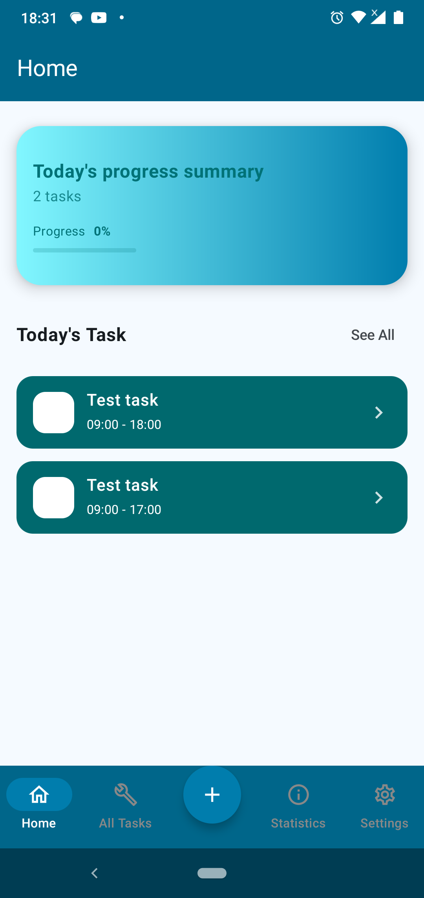    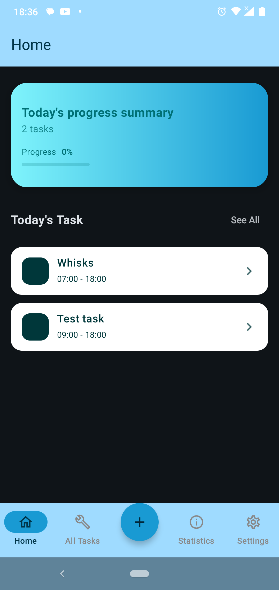

### Create Task Screen
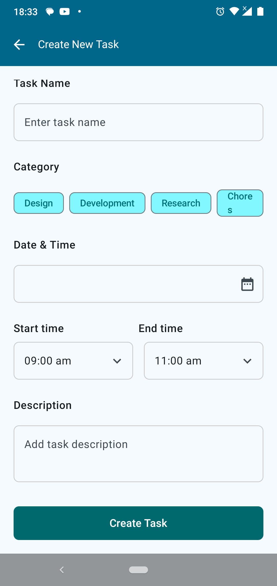
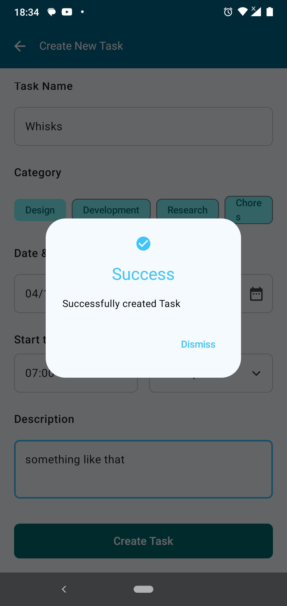
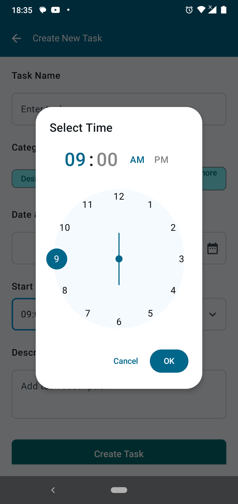

### Statistics Screen
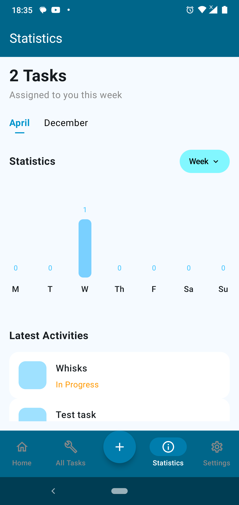    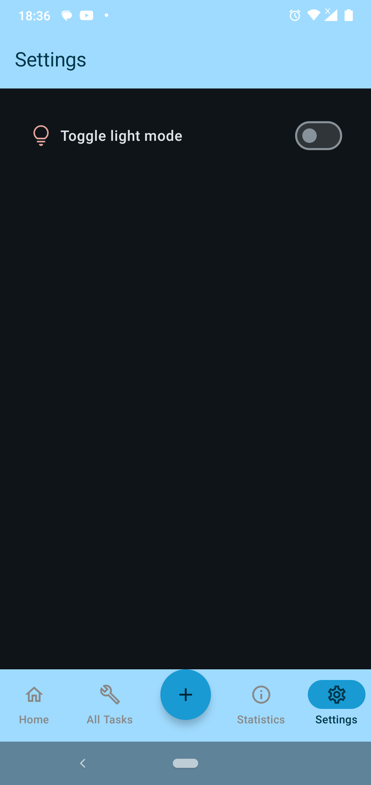

### Task Detail Screen
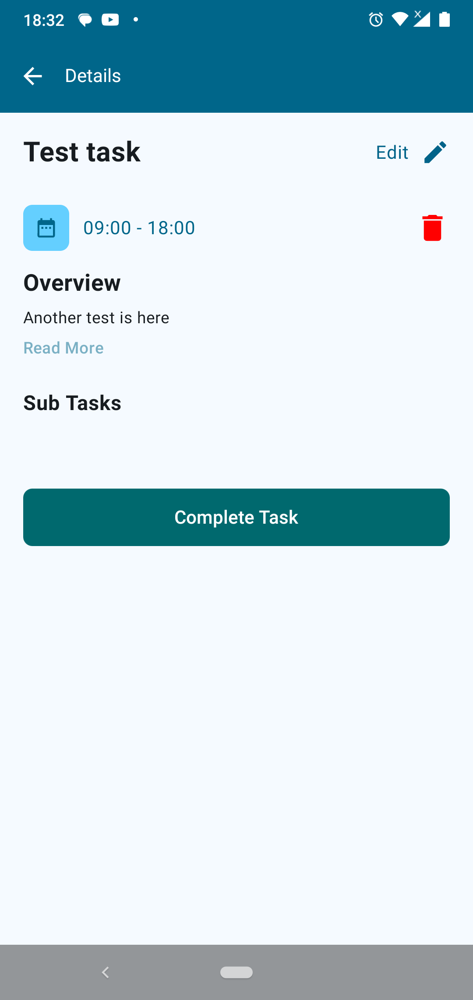    

### Settings Screen
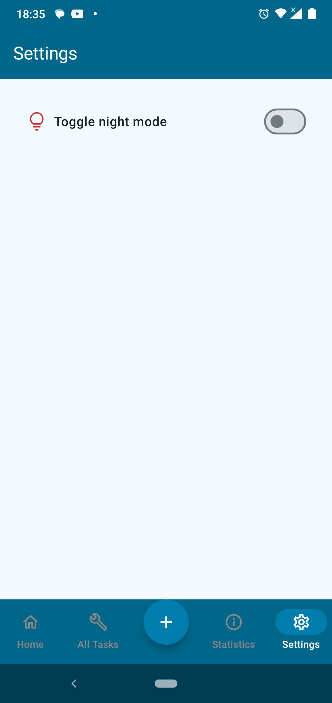    

### All tasks Screen
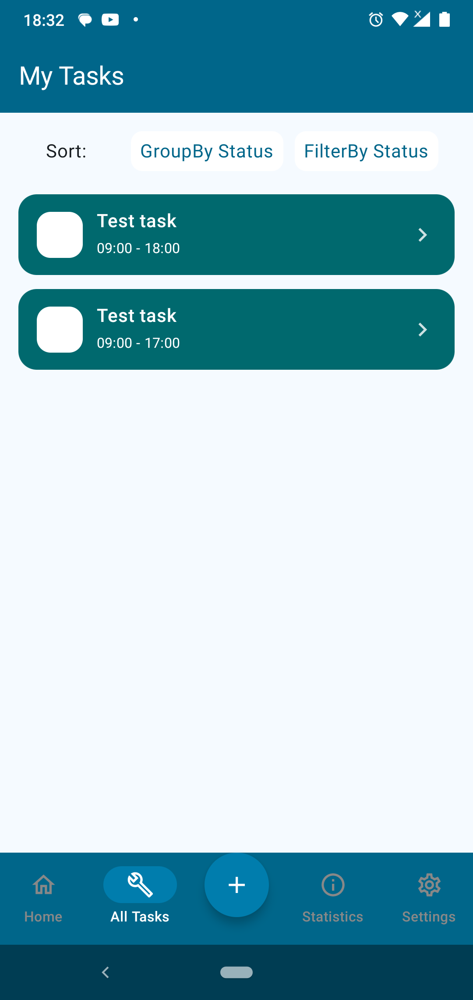    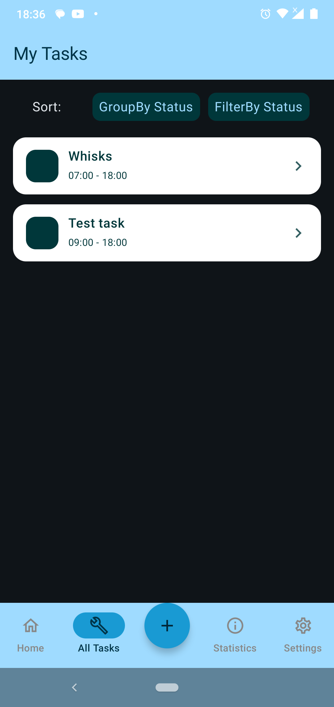
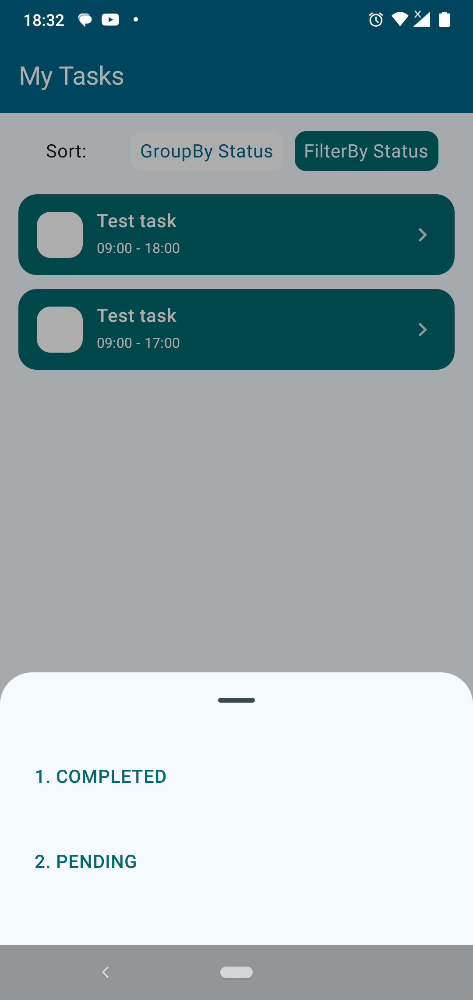
